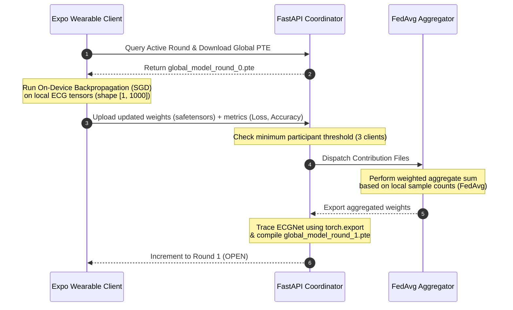
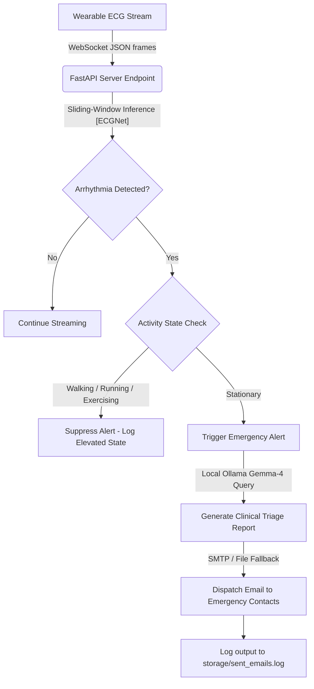

# 🏥 Pulse-FL: Privacy-First Clinical Wearable Edge Intelligence Framework

Pulse-FL is a production-grade, real-time signal processing and federated learning (FL) coordinator framework designed for wearable devices and edge sensors. It enables continuous cardiac telemetry monitoring, real-time arrhythmia classification, activity-aware alert suppression, and local generative clinician triage—all while maintaining strict patient data privacy through on-device model training.

This repository is structured as a **Node.js monorepo workspace** separating the Python coordinating server and the Expo React Native mobile client.

---

## 📂 Workspace Architecture

```text
pulse-fl/ (Monorepo Root)
├── package.json                 # Unified monorepo config & workspace launch scripts
├── README.md                    # Parent monorepo orchestrator guide
├── CODE_OF_CONDUCT.md           # Community guidelines
├── CONTRIBUTING.md              # Developer guidelines
├── LICENSE.md                   # MIT License
├── SECURITY.md                  # Security disclosures & Safetensors policies
└── apps/
    ├── backend/                 # Python FastAPI Coordinator & Federated Aggregator
    │   └── README.md            # Detailed server installation, config, & scripting guide
    └── mobile/                  # React Native Expo Wearable Node
        └── README.md            # Detailed mobile client, ExecuTorch C++ module, & JS fallback guide
```

---

## 📐 Unified System Workflows

### 1. Federated Learning Aggregation Loop
Patient signals (single-lead ECGs) never leave the device to train the global model. Model weights are trained locally and secure updates are transmitted via the secure `safetensors` format.



### 2. Real-Time Telemetry & Clinician Triage
Continuous wearable sensor readings stream to the gateway. Alert suppression prevents false alarms, and localized LLMs parse confirmed anomalies to output clinical report triage.



---

## ⚡ Unified Quick Start

### Prerequisites
* **Node.js**: Version 18+ (with `npm`)
* **Python**: Version 3.13+
* **uv**: Astral Python package installer
  ```bash
  curl -LsSf https://astral.sh/uv/install.sh | sh
  ```

### 1. Unified Environment Synchronization
Run the workspace setup script in the root directory. This will execute `uv sync` on the backend and `npm install` on the mobile application:
```bash
npm run setup
```

### 2. Launch Dev Servers Concurrently
To boot both the FastAPI coordinating server and the Expo bundler concurrently:
```bash
npm run dev
```
* **FastAPI Dashboard Portal**: http://127.0.0.1:8000/
* **FastAPI OpenAPI docs**: http://127.0.0.1:8000/docs
* **Expo Metro Console**: Access developers tools, select simulators, or scan the QR code to test on physical devices.

---

## 🔗 Sub-project Guides

For deep-dive setup, testing parameters, and advanced customization guides:
* **Backend Coordinator Server**: Go to [apps/backend/README.md](file:///home/galahad/.gemini/antigravity/scratch/pulse-fl/apps/backend/README.md)
* **Mobile Client Application**: Go to [apps/mobile/README.md](file:///home/galahad/.gemini/antigravity/scratch/pulse-fl/apps/mobile/README.md)

---

## ⚖️ License & Authorship
Copyright (c) 2026 **@bernardbdas** on GitHub. Distributed under the terms of the MIT License.
